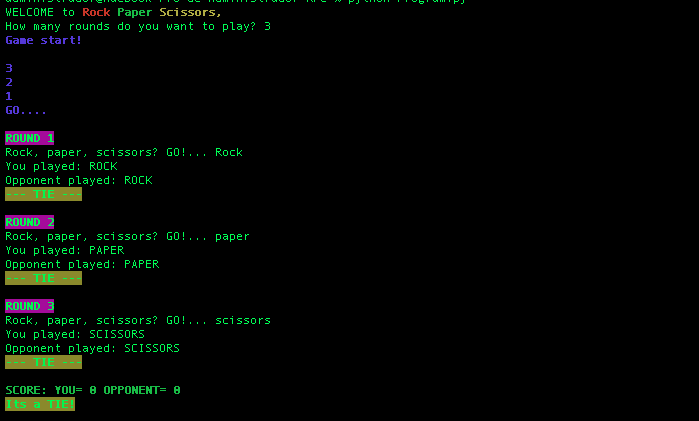

# RPC
Python Rock Paper scissors Game. After you run the program, 
choose how many rounds you want to play, the program will track the result and will give a winner at the end of the game. One cool additional feature is that the computer has
three ways to play. wich will choose randomly at the beginning of every match.

## First Look

## Oponents play
+ First, the opponent is going to choose one option again and again.
+ Opponent will choose a random option between rock paper or scissors.
+ Opponent will remember the las move to form the player, so if the player type paper in the last Round the opponent will play scissors.

## Do you want to play?
+ Download this repository
+ Run `python Program.py` in your terminal.

## Sources

+ [Python Classes](https://docs.python.org/3/tutorial/classes.html)
+ [Colors in the terminal](https://www.lihaoyi.com/post/BuildyourownCommandLinewithANSIescapecodes.html)

 
